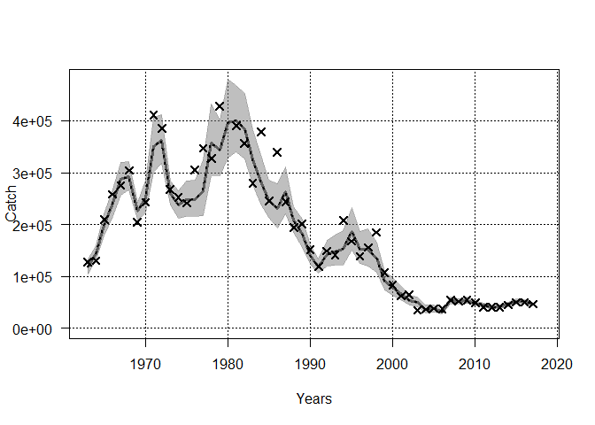
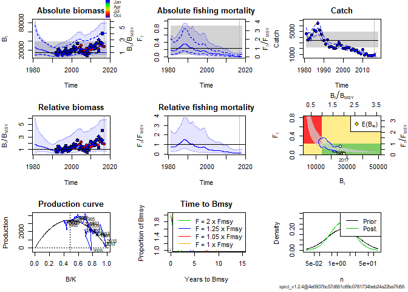

readme
================

Prerequisites
-------------

Before installing FLfse, the following non-CRAN R packages should be installed:

-   stockassessment (available from <https://github.com/fishfollower/SAM>)
-   spict (available from <https://github.com/mawp/spict/>)
-   FLR packages FLCore and ggplotFL (see <http://www.flr-project.org/#install>)

Install FLfse
-------------

FLfse can be installed with

``` r
devtools::install_github("shfischer/FLfse/FLfse")
```

Showcase functionality
----------------------

load package

``` r
library(FLfse)
```

The package includes example data for some stocks, see

``` r
data(package = "FLfse")
```

Currently, this includes the 2017 assessment for Irish Sea plaice, the 2018 assessments for North Sea cod, North Sea haddock and North Sea whiting and the 2019 assessment for North Sea herring.

Run stock assessments
=====================

SAM
---

Fit SAM to North Sea cod data, with default parametrizations:

``` r
fit <- FLR_SAM(stk = cod4_stk, idx = cod4_idx)
```

    ## Loading required package: lattice

    ## Loading required package: iterators

    ## FLCore (Version 2.6.12, packaged: 2019-02-19 16:16:28 UTC)

use the SAM assessment configuration as used by ICES WGNSSK 2018:

``` r
### fit SAM model
fit <- FLR_SAM(stk = cod4_stk, idx = cod4_idx, conf = cod4_conf_sam)
### check convergence
fit$opt$convergence
```

    ## [1] 0

``` r
### The result of FLR_SAM() is an object of class "sam". 
### All methods defined in the stockassessment package can be used on it.
### summary table
summary(fit)
```

    ##      R(age 1)     Low    High    SSB    Low   High Fbar(2-4)   Low  High
    ## 1963   398864  289535  549476 145056 114396 183934     0.490 0.425 0.564
    ## 1964   651351  473524  895960 157003 126165 195380     0.528 0.465 0.601
    ## 1965   874233  637821 1198275 192537 159332 232663     0.579 0.511 0.657
    ## 1966  1062544  776067 1454771 213818 177765 257183     0.587 0.520 0.662
    ## 1967   890549  650148 1219843 242898 202125 291894     0.620 0.552 0.697
    ## 1968   448728  326969  615830 255832 219047 298795     0.656 0.583 0.738
    ## 1969   392556  284087  542441 251522 213202 296728     0.627 0.558 0.703
    ## 1970  1321591  962787 1814110 261751 222799 307513     0.665 0.596 0.743
    ## 1971  1734814 1258515 2391374 266191 226760 312478     0.747 0.671 0.831
    ## 1972   428894  310617  592209 237657 202254 279256     0.803 0.721 0.894
    ## 1973   635387  460324  877028 210703 185078 239875     0.794 0.714 0.883
    ## 1974   631387  456634  873017 225799 197922 257601     0.763 0.686 0.849
    ## 1975  1085420  778290 1513751 203488 176897 234076     0.815 0.735 0.904
    ## 1976   752472  535390 1057572 173152 148538 201844     0.867 0.780 0.963
    ## 1977  1832441 1312566 2558226 146146 125714 169898     0.829 0.747 0.920
    ## 1978  1121065  799291 1572378 145892 129326 164581     0.907 0.820 1.005
    ## 1979  1400592 1002243 1957266 145125 129715 162367     0.860 0.778 0.952
    ## 1980  2261414 1609560 3177261 158705 142629 176594     0.930 0.843 1.025
    ## 1981   876555  625986 1227423 167149 151389 184549     0.948 0.862 1.043
    ## 1982  1439757 1038977 1995138 167389 150999 185559     1.047 0.953 1.151
    ## 1983   800367  587331 1090675 136979 123166 152341     1.046 0.953 1.149
    ## 1984  1481585 1088119 2017329 119012 106746 132688     0.988 0.900 1.084
    ## 1985   358913  260702  494121 117385 105134 131064     0.955 0.869 1.049
    ## 1986  1625467 1197681 2206050 108388  98046 119821     1.001 0.914 1.098
    ## 1987   617457  456733  834739 110237  99353 122313     0.984 0.897 1.079
    ## 1988   426224  314860  576976 110178 100818 120407     1.005 0.917 1.101
    ## 1989   745534  548269 1013774 101541  92366 111628     1.019 0.928 1.118
    ## 1990   295322  218878  398465  89913  81318  99416     0.955 0.867 1.052
    ## 1991   339399  252176  456792  88668  79517  98872     0.942 0.853 1.041
    ## 1992   792194  588326 1066706  85350  76304  95469     0.936 0.841 1.041
    ## 1993   394504  295530  526625  88375  75168 103903     0.944 0.842 1.059
    ## 1994   955384  703812 1296879  95545  80601 113260     0.958 0.853 1.076
    ## 1995   547278  406514  736786 110842  93376 131576     0.992 0.883 1.116
    ## 1996   351284  262552  470004 110348  93005 130925     0.991 0.881 1.114
    ## 1997  1089999  795354 1493796  99750  84553 117677     0.975 0.869 1.093
    ## 1998   111936   82845  151243  96772  81382 115072     1.001 0.893 1.122
    ## 1999   229672  172285  306175  82354  68841  98519     1.044 0.930 1.172
    ## 2000   422524  317091  563014  64321  54088  76489     1.040 0.926 1.168
    ## 2001   154024  115180  205968  61256  51786  72457     0.976 0.869 1.095
    ## 2002   233307  175304  310502  55558  46982  65700     0.924 0.820 1.042
    ## 2003   115009   85932  153924  56871  48072  67281     0.905 0.801 1.021
    ## 2004   196468  149532  258136  45670  38670  53936     0.859 0.759 0.972
    ## 2005   154259  115848  205407  48389  41744  56091     0.799 0.702 0.909
    ## 2006   359929  275636  469998  44507  39031  50752     0.735 0.656 0.823
    ## 2007   168870  129567  220096  76643  67842  86586     0.689 0.612 0.775
    ## 2008   190204  145843  248057  83653  74197  94314     0.658 0.580 0.746
    ## 2009   183318  140233  239642  89933  78842 102583     0.650 0.569 0.743
    ## 2010   274919  209519  360733  88828  75989 103836     0.578 0.498 0.670
    ## 2011   132904  101506  174013  96198  79729 116068     0.485 0.412 0.571
    ## 2012   179434  137538  234092  93960  76751 115029     0.450 0.380 0.534
    ## 2013   226194  173181  295435  99494  81167 121960     0.442 0.375 0.521
    ## 2014   317568  242921  415153 105714  86598 129050     0.445 0.380 0.520
    ## 2015   155316  118799  203058 119893  97172 147926     0.433 0.371 0.506
    ## 2016   109912   82134  147083 119699  97197 147411     0.423 0.359 0.498
    ## 2017   385593  259272  573460 113502  90267 142718     0.444 0.373 0.528
    ## 2018    97383   40347  235049 118387  90333 155154     0.446 0.353 0.563

``` r
### plot model
plot(fit)
```


``` r
### plot catch
catchplot(fit)
```

 The resulting "sam" object can then be converted into an FLStock object:

``` r
cod4 <- SAM2FLStock(fit, cod4_stk)
### plot with ggplotFL
library(ggplotFL)
```

    ## Loading required package: ggplot2

    ## Warning: package 'ggplot2' was built under R version 3.5.3

    ## 
    ## Attaching package: 'ggplot2'

    ## The following object is masked from 'package:FLCore':
    ## 
    ##     %+%

    ## Warning: replacing previous import 'ggplot2::%+%' by 'FLCore::%+%' when
    ## loading 'ggplotFL'

``` r
plot(cod4)
```


SPiCT
-----

Another assessment method implemented is the Surplus Production in Continuous Time (SPiCT) model (Pedersen & Berg, 2017).

``` r
library(spict)
```

    ## Loading required package: TMB

    ## Welcome to spict_v1.2.4@4e0937bc57d851c69c0781734beb24a22ba7fd55

    ## 
    ## Attaching package: 'spict'

    ## The following object is masked from 'package:stockassessment':
    ## 
    ##     retro

``` r
### fit SPiCT to Irish Sea plaice
fit <- FLR_SPiCT(stk = ple7a_stk, idx = ple7a_idx)
### check results
fit
```

    ## Convergence: 0  MSG: relative convergence (4)
    ## Objective function at optimum: 26.4402125
    ## Euler time step (years):  1/16 or 0.0625
    ## Nobs C: 36,  Nobs I1: 24,  Nobs I2: 25,  Nobs I3: 25
    ## 
    ## Priors
    ##      logn  ~  dnorm[log(2), 2^2]
    ##  logalpha  ~  dnorm[log(1), 2^2]
    ##   logbeta  ~  dnorm[log(1), 2^2]
    ## 
    ## Model parameter estimates w 95% CI 
    ##             estimate        cilow        ciupp    log.est  
    ##  alpha1 1.309531e+00 4.504982e-01 3.806613e+00  0.2696694  
    ##  alpha2 4.706637e+00 1.939836e+00 1.141974e+01  1.5489736  
    ##  alpha3 3.604607e+00 1.496284e+00 8.683638e+00  1.2822128  
    ##  beta   6.677472e-01 3.391249e-01 1.314814e+00 -0.4038456  
    ##  r      4.416120e-01 5.310730e-02 3.672211e+00 -0.8173235  
    ##  rc     4.876903e-01 1.425775e-01 1.668158e+00 -0.7180748  
    ##  rold   5.445044e-01 4.724700e-03 6.275205e+01 -0.6078792  
    ##  m      3.432591e+03 2.413676e+03 4.881632e+03  8.1410706  
    ##  K      2.927722e+04 1.345425e+04 6.370892e+04 10.2845649  
    ##  q1     6.882000e-04 3.553000e-04 1.333200e-03 -7.2814109  
    ##  q2     6.109000e-04 3.096000e-04 1.205500e-03 -7.4005231  
    ##  q3     5.149000e-04 2.630000e-04 1.008300e-03 -7.5714524  
    ##  n      1.811035e+00 9.065990e-02 3.617749e+01  0.5938984  
    ##  sdb    8.577280e-02 3.810100e-02 1.930916e-01 -2.4560532  
    ##  sdf    2.002834e-01 1.294306e-01 3.099224e-01 -1.6080218  
    ##  sdi1   1.123222e-01 7.184460e-02 1.756051e-01 -2.1863838  
    ##  sdi2   4.037015e-01 3.022965e-01 5.391227e-01 -0.9070796  
    ##  sdi3   3.091773e-01 2.295761e-01 4.163787e-01 -1.1738404  
    ##  sdc    1.337387e-01 8.884840e-02 2.013096e-01 -2.0118674  
    ##  
    ## Deterministic reference points (Drp)
    ##            estimate        cilow        ciupp   log.est  
    ##  Bmsyd 1.407693e+04 5023.1546463 3.944930e+04  9.552293  
    ##  Fmsyd 2.438451e-01    0.0712887 8.340791e-01 -1.411222  
    ##  MSYd  3.432591e+03 2413.6762928 4.881632e+03  8.141071  
    ## Stochastic reference points (Srp)
    ##            estimate        cilow        ciupp   log.est rel.diff.Drp  
    ##  Bmsys 1.394239e+04 5024.3731301 3.868946e+04  9.542689 -0.009649558  
    ##  Fmsys 2.423822e-01    0.0682146 8.612394e-01 -1.417239 -0.006035666  
    ##  MSYs  3.379191e+03 2295.5262397 4.974428e+03  8.125391 -0.015802598  
    ## 
    ## States w 95% CI (inp$msytype: s)
    ##                     estimate        cilow        ciupp   log.est  
    ##  B_2016.75      2.804858e+04 1.393176e+04 5.646974e+04 10.241693  
    ##  F_2016.75      2.929030e-02 1.381330e-02 6.210860e-02 -3.530497  
    ##  B_2016.75/Bmsy 2.011748e+00 7.124550e-01 5.680541e+00  0.699004  
    ##  F_2016.75/Fmsy 1.208436e-01 3.052710e-02 4.783673e-01 -2.113258  
    ## 
    ## Predictions w 95% CI (inp$msytype: s)
    ##                   prediction        cilow        ciupp    log.est  
    ##  B_2017.00      2.792904e+04 1.378030e+04 5.660483e+04 10.2374223  
    ##  F_2017.00      2.935800e-02 1.354000e-02 6.365550e-02 -3.5281887  
    ##  B_2017.00/Bmsy 2.003174e+00 7.041898e-01 5.698332e+00  0.6947331  
    ##  F_2017.00/Fmsy 1.211229e-01 3.022160e-02 4.854403e-01 -2.1109493  
    ##  Catch_2017.00  8.156632e+02 5.362028e+02 1.240774e+03  6.7040015  
    ##  E(B_inf)       2.689309e+04           NA           NA 10.1996248

``` r
plot(fit)
```



``` r
### pass additional configuration, set time step to 1 per year
conf <- list(dteuler = 1)
fit2 <- FLR_SPiCT(stk = ple7a_stk, idx = ple7a_idx, conf = conf)
fit2
```

    ## Convergence: 0  MSG: both X-convergence and relative convergence (5)
    ## Objective function at optimum: 27.4814837
    ## Euler time step (years):  1/1 or 1
    ## Nobs C: 36,  Nobs I1: 24,  Nobs I2: 25,  Nobs I3: 25
    ## 
    ## Priors
    ##      logn  ~  dnorm[log(2), 2^2]
    ##  logalpha  ~  dnorm[log(1), 2^2]
    ##   logbeta  ~  dnorm[log(1), 2^2]
    ## 
    ## Model parameter estimates w 95% CI 
    ##             estimate        cilow        ciupp    log.est  
    ##  alpha1 1.833088e+00 7.406168e-01 4.537044e+00  0.6060019  
    ##  alpha2 6.224078e+00 2.774239e+00 1.396388e+01  1.8284253  
    ##  alpha3 4.735062e+00 2.136901e+00 1.049221e+01  1.5549948  
    ##  beta   5.739771e-01 2.133712e-01 1.544022e+00 -0.5551657  
    ##  r      3.826181e-01 4.344490e-02 3.369706e+00 -0.9607179  
    ##  rc     4.165141e-01 1.655733e-01 1.047777e+00 -0.8758350  
    ##  rold   4.569995e-01 7.957900e-03 2.624434e+01 -0.7830730  
    ##  m      3.406990e+03 2.590150e+03 4.481432e+03  8.1335844  
    ##  K      3.382915e+04 1.483959e+04 7.711882e+04 10.4290781  
    ##  q1     5.922000e-04 3.093000e-04 1.133700e-03 -7.4316769  
    ##  q2     5.296000e-04 2.717000e-04 1.032300e-03 -7.5433635  
    ##  q3     4.464000e-04 2.309000e-04 8.631000e-04 -7.7142928  
    ##  n      1.837240e+00 1.144797e-01 2.948514e+01  0.6082643  
    ##  sdb    6.550290e-02 3.165010e-02 1.355646e-01 -2.7256612  
    ##  sdf    1.877416e-01 1.251456e-01 2.816472e-01 -1.6726889  
    ##  sdi1   1.200725e-01 8.070520e-02 1.786429e-01 -2.1196593  
    ##  sdi2   4.076950e-01 3.056279e-01 5.438484e-01 -0.8972359  
    ##  sdi3   3.101602e-01 2.310844e-01 4.162953e-01 -1.1706664  
    ##  sdc    1.077594e-01 5.254720e-02 2.209837e-01 -2.2278546  
    ##  
    ## Deterministic reference points (Drp)
    ##            estimate        cilow        ciupp   log.est  
    ##  Bmsyd 16359.542113 7166.9754235 3.734276e+04  9.702567  
    ##  Fmsyd     0.208257    0.0827867 5.238886e-01 -1.568982  
    ##  MSYd   3406.989795 2590.1495950 4.481432e+03  8.133584  
    ## Stochastic reference points (Srp)
    ##            estimate        cilow        ciupp   log.est rel.diff.Drp  
    ##  Bmsys 1.625633e+04 7170.3872307 3.685552e+04  9.696238 -0.006348845  
    ##  Fmsys 2.073711e-01    0.0805211 5.340559e-01 -1.573245 -0.004272238  
    ##  MSYs  3.371002e+03 2515.8159839 4.516887e+03  8.122965 -0.010675618  
    ## 
    ## States w 95% CI (inp$msytype: s)
    ##                     estimate        cilow        ciupp    log.est  
    ##  B_2016.00      3.314501e+04 1.673913e+04 6.563018e+04 10.4086476  
    ##  F_2016.00      2.513070e-02 1.239730e-02 5.094290e-02 -3.6836638  
    ##  B_2016.00/Bmsy 2.038899e+00 8.445557e-01 4.922242e+00  0.7124098  
    ##  F_2016.00/Fmsy 1.211872e-01 4.020240e-02 3.653106e-01 -2.1104184  
    ## 
    ## Predictions w 95% CI (inp$msytype: s)
    ##                   prediction        cilow        ciupp    log.est  
    ##  B_2017.00      3.224465e+04 1.573063e+04 6.609509e+04 10.3811074  
    ##  F_2017.00      2.513070e-02 1.132940e-02 5.574440e-02 -3.6836637  
    ##  B_2017.00/Bmsy 1.983513e+00 7.828964e-01 5.025345e+00  0.6848696  
    ##  F_2017.00/Fmsy 1.211872e-01 3.787100e-02 3.877993e-01 -2.1104184  
    ##  Catch_2017.00  8.103317e+02 5.238780e+02 1.253417e+03  6.6974437  
    ##  E(B_inf)       3.126376e+04           NA           NA 10.3502148

SAM for North Sea herring
-------------------------

The HAWG assessment for North Sea herring can be replicated with `FLfse`. To get this assessment running, a different branch ("components") of the `stockassessment` package needs to be installed. The following code snippet shows how to do this without interfering with the global packages (please restart R if another version of stockassessment is currently loaded):

``` r
### 1st: add a temporary R package library 
.libPaths(c(tempdir(), .libPaths()))
### 2nd: install stockassessment branch "components"
devtools::install_github("fishfollower/SAM/stockassessment", ref = "components")

### now, the assessment can be run:
library(FLfse)
library(stockassessment)
### replicate HAWG assessment
fit <- FLR_SAM(stk = her4_stk, idx = her4_idx, conf = her4_conf_sam, 
                    conf_full = TRUE, NA_rm = FALSE)
### check results
fit
plot(fit)
summary(fit)
### convert into FLStock
stk <- SAM2FLStock(fit, her4_stk)
```
