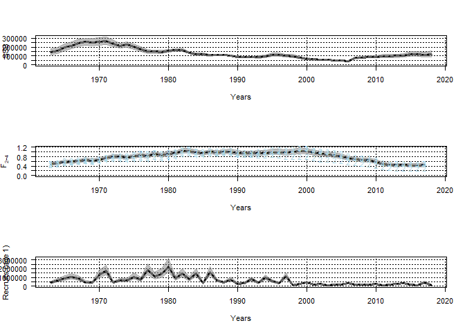
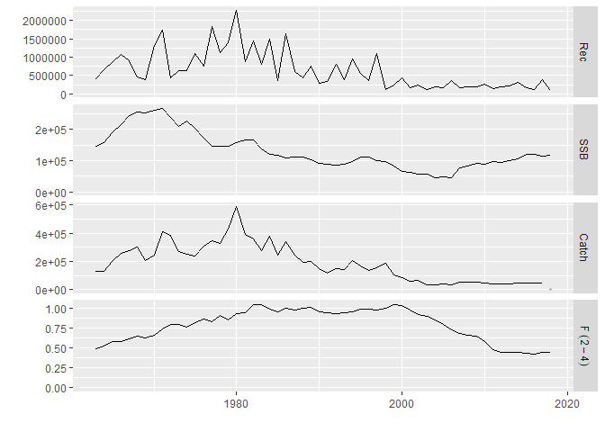
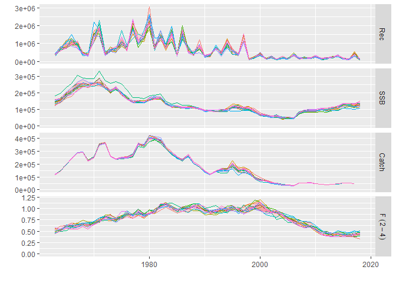

FLfse
================

An R package for providing an interface between the SAM stock assessment
(SAM, <https://github.com/fishfollower/SAM>) and the Fisheries Library
in R (FLR, <https://flr-project.org/>).

The package provides methods for running SAM with FLR objects
(`FLR_SAM`) and functions useful for conducting a Management Strategy
Evaluation (MSE). This includes methods for turning the output of a SAM
model fit into FLR’s `FLStock` (`SAM2FLStock`) and for creating
simulation replicates based on SAM’s variance-covariance matrix
(`SAM_uncertainty`).

## Prerequisites

Before installing FLfse, the following non-CRAN R packages should be
installed:

-   stockassessment (available from
    <https://github.com/fishfollower/SAM>)
-   FLR packages FLCore and ggplotFL (see
    <http://www.flr-project.org/#install>)

## Install FLfse

FLfse can be installed with

``` r
remotes::install_github("shfischer/FLfse/FLfse")
```

## Showcase functionality

Load package

``` r
library(FLfse)
```

The package includes example data for some stocks, see

``` r
data(package = "FLfse")
```

Among others, this includes the 2018 assessments for North Sea cod,
North Sea haddock and North Sea whiting and the 2019 assessment for
North Sea herring.

### Run SAM stock assessments

#### North Sea cod

Fit SAM to North Sea cod data from ICES WGNSSK 2018, with default
parameterisations:

``` r
fit <- FLR_SAM(stk = cod4_stk, idx = cod4_idx)
```

use the SAM assessment configuration as used by ICES WGNSSK 2018:

``` r
### fit SAM model
fit <- FLR_SAM(stk = cod4_stk, idx = cod4_idx, conf = cod4_conf_sam)
### check convergence
fit$opt$convergence
```

    ## [1] 0

``` r
### The result of FLR_SAM() is an object of class "sam". 
### All methods defined in the stockassessment package can be used on it.
### summary table
tail(summary(fit))
```

    ##      R(age 1)    Low   High    SSB   Low   High Fbar(2-4)   Low  High
    ## 2013   226194 173181 295435  99494 81167 121960     0.442 0.375 0.521
    ## 2014   317568 242921 415153 105714 86598 129050     0.445 0.380 0.520
    ## 2015   155316 118799 203058 119893 97172 147926     0.433 0.371 0.506
    ## 2016   109912  82134 147083 119699 97197 147411     0.423 0.359 0.498
    ## 2017   385593 259272 573460 113502 90267 142718     0.444 0.373 0.528
    ## 2018    97383  40347 235049 118387 90333 155154     0.446 0.353 0.563

``` r
### plot model
plot(fit)
```

<!-- --> The resulting
“sam” object can then be converted into an FLStock object:

``` r
cod4 <- SAM2FLStock(fit, cod4_stk)
### plot with ggplotFL
library(ggplotFL)
plot(cod4)
```

<!-- -->

#### North Sea herring

The 2019 ICES HAWG assessment for North Sea herring can be replicated
with `FLfse`. To get this assessment running, a different branch
(“components”) of the `stockassessment` package needs to be installed.
The following code snippet shows how to do this without interfering with
the global packages (please restart R if another version of
stockassessment is currently loaded):

``` r
### 1st: add a temporary R package library 
.libPaths(c(tempdir(), .libPaths()))
### 2nd: install stockassessment branch "components"
devtools::install_github("fishfollower/SAM/stockassessment", ref = "components")

### now, the assessment can be run:
library(FLfse)
library(stockassessment)
### replicate HAWG assessment
fit <- FLR_SAM(stk = her4_stk, idx = her4_idx, conf = her4_conf_sam, 
                    conf_full = TRUE, NA_rm = FALSE)
### check results
fit
plot(fit)
summary(fit)
### convert into FLStock
stk <- SAM2FLStock(fit, her4_stk)
```

### Create simulation replicates from SAM model fit

We can use SAM’s variance-covariance matrix to create simulation
replicates (e.g. for MSE).

``` r
### fit SAM to North Sea cod
fit <- FLR_SAM(stk = cod4_stk, idx = cod4_idx, conf = cod4_conf_sam)
### create simulation replicates
set.seed(1)
unc <- SAM_uncertainty(fit = fit, n = 10)
### turn into FLStock
stk <- SAM2FLStock(fit, cod4_stk)
### insert replicates for stock numbers, catch numbers and fishing mortality
stk <- propagate(stk, 10)
stock.n(stk) <- unc$stock.n ### insert stock numbers
stock <- computeStock(stk) ### update stock biomass
catch.n(stk)[, ac(1963:2017)] <- unc$catch.n ### insert catch numbers
catch(stk) <- computeCatch(stk) ### update total catch
harvest(stk) <- unc$harvest ### insert fishing mortality at age
units(harvest(stk)) <- "f"
### plot stock and replicates
plot(stk, iter = 1:10)
```

<!-- -->
