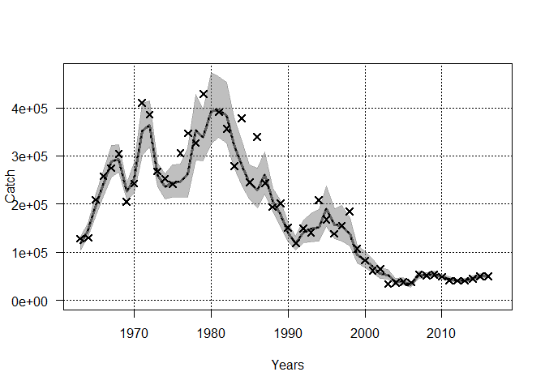
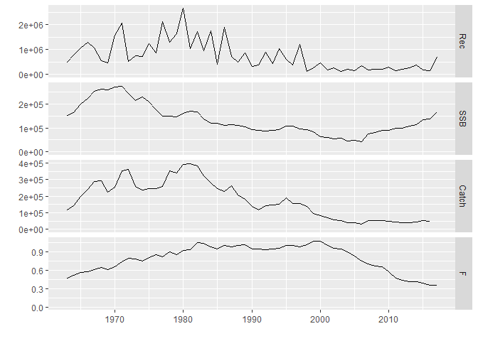
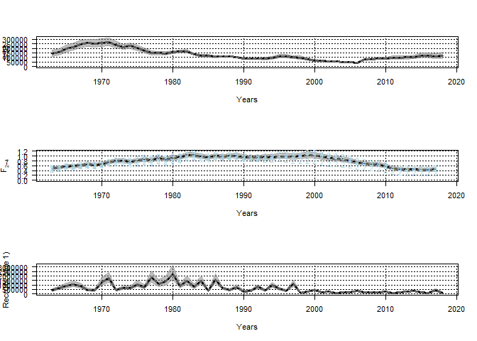
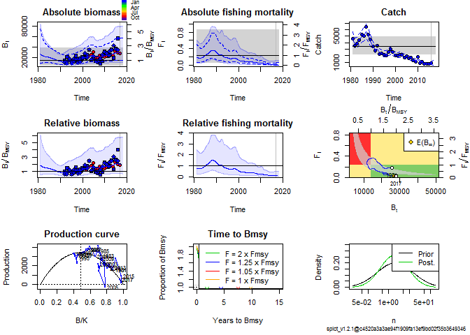

readme
================

Prerequisites
-------------

Before installing FLfse, the following non-CRAN R packages should be installed:

-   stockassessment (available from <https://github.com/fishfollower/SAM>)
-   spict (available from <https://github.com/mawp/spict/>)
-   FLR packages FLCore and ggplotFL (see <http://www.flr-project.org/#install>)

Install FLfse
-------------

FLfse can be installed with

``` r
devtools::install_github("shfischer/FLfse/FLfse")
```

Showcase functionality
----------------------

load package

``` r
library(FLfse)
```

    ## Loading required package: FLCore

    ## Loading required package: MASS

    ## Loading required package: lattice

    ## FLCore (Version 2.6.4.9002, packaged: Wed Jan 10 11:08:21 2018)

The package includes example data for some stocks, see

``` r
data(package = "FLfse")
```

Currently, this includes North Sea cod and Irish Sea plaice.

Run stock assessments
=====================

SAM
---

Fit SAM to North Sea cod data, with default parametrizations:

``` r
library(stockassessment)
fit <- FLR_SAM(stk = cod4_stk, idx = cod4_idx)
```

use the SAM assessment configuration as used by ICES WGNSSK 2017:

``` r
### fit SAM model
fit <- FLR_SAM(stk = cod4_stk, idx = cod4_idx, conf = cod4_conf_sam)
### check convergence
fit$opt$convergence
```

    ## [1] 0

``` r
### The result of FLR_SAM() is an object of class "sam". 
### All methods defined in the stockassessment package can be used on it.
### summary table
summary(fit)
```

    ##      R(age 1)     Low    High    SSB    Low   High Fbar(2-4)   Low  High
    ## 1963   483443  349623  668482 152567 117217 198578     0.476 0.410 0.551
    ## 1964   788652  571393 1088517 164117 128658 209349     0.515 0.451 0.589
    ## 1965  1053740  766491 1448636 200160 161989 247327     0.565 0.495 0.645
    ## 1966  1278017  930659 1755022 222222 180955 272900     0.572 0.503 0.649
    ## 1967  1073869  781741 1475160 251943 205479 308913     0.607 0.537 0.687
    ## 1968   537651  390601  740061 263057 221446 312487     0.642 0.568 0.727
    ## 1969   470143  339405  651240 259170 215989 310984     0.613 0.544 0.691
    ## 1970  1571594 1142538 2161775 270317 226557 322530     0.651 0.580 0.730
    ## 1971  2051908 1486529 2832320 274633 230563 327128     0.735 0.658 0.821
    ## 1972   504948  365444  697706 244037 204806 290783     0.794 0.711 0.887
    ## 1973   740991  536612 1023213 215006 186651 247669     0.780 0.699 0.871
    ## 1974   724784  523989 1002525 230334 199868 265444     0.749 0.671 0.836
    ## 1975  1245376  893350 1736117 207745 178734 241465     0.804 0.723 0.894
    ## 1976   860305  612942 1207495 177134 150304 208754     0.858 0.770 0.956
    ## 1977  2114847 1515546 2951132 149959 127657 176158     0.821 0.737 0.913
    ## 1978  1299703  928115 1820064 149402 131578 169641     0.903 0.813 1.002
    ## 1979  1639351 1174554 2288079 147508 131037 166050     0.850 0.766 0.944
    ## 1980  2654566 1893368 3721792 161008 143929 180113     0.923 0.835 1.021
    ## 1981  1042618  745798 1457569 168798 152169 187244     0.940 0.852 1.037
    ## 1982  1719917 1245935 2374213 168211 151002 187382     1.046 0.949 1.152
    ## 1983   944190  694886 1282936 137680 123137 153939     1.043 0.948 1.147
    ## 1984  1741468 1283866 2362171 119779 106803 134331     0.981 0.892 1.080
    ## 1985   416072  301695  573810 118501 105594 132986     0.947 0.860 1.044
    ## 1986  1898270 1402201 2569839 109246  98283 121432     0.998 0.908 1.096
    ## 1987   713573  528742  963015 113010 101469 125864     0.982 0.893 1.080
    ## 1988   484502  358453  654876 111254 101400 122064     1.001 0.911 1.100
    ## 1989   850878  626499 1155619 103128  93492 113758     1.018 0.925 1.119
    ## 1990   328235  243663  442161  92235  83195 102257     0.950 0.860 1.049
    ## 1991   376409  280177  505694  89892  80390 100517     0.941 0.850 1.041
    ## 1992   877787  653553 1178957  85849  76593  96223     0.933 0.837 1.040
    ## 1993   427330  321276  568392  88293  75283 103550     0.945 0.838 1.066
    ## 1994  1047219  775401 1414323  93896  79525 110864     0.962 0.852 1.087
    ## 1995   599021  446440  803749 106384  90181 125497     1.003 0.887 1.133
    ## 1996   379340  284534  505736 106154  89926 125310     1.007 0.891 1.138
    ## 1997  1206223  881752 1650094  95462  81286 112110     0.982 0.871 1.107
    ## 1998   120129   89115  161937  91621  77704 108031     1.012 0.899 1.140
    ## 1999   246280  185184  327535  82664  69540  98266     1.071 0.950 1.208
    ## 2000   452056  339827  601349  64157  54222  75914     1.072 0.950 1.210
    ## 2001   161184  120772  215117  60468  51385  71158     1.001 0.888 1.129
    ## 2002   246401  185080  328039  55492  47179  65271     0.953 0.842 1.078
    ## 2003   118414   88638  158192  57848  49200  68016     0.941 0.831 1.067
    ## 2004   200788  152467  264424  45947  39112  53977     0.898 0.791 1.020
    ## 2005   152815  115066  202948  48627  42101  56164     0.835 0.731 0.954
    ## 2006   359204  274852  469443  43569  38423  49405     0.754 0.674 0.845
    ## 2007   168263  129251  219050  75911  67491  85380     0.699 0.622 0.786
    ## 2008   194484  149128  253633  82229  73350  92183     0.666 0.588 0.754
    ## 2009   189357  145217  246914  90340  79825 102240     0.655 0.575 0.747
    ## 2010   293052  223500  384249  90510  78377 104522     0.572 0.496 0.661
    ## 2011   143013  109359  187024  99811  84189 118331     0.472 0.404 0.551
    ## 2012   200454  153835  261200  98341  81970 117981     0.432 0.368 0.506
    ## 2013   264161  202396  344775 106760  89048 127994     0.418 0.358 0.489
    ## 2014   378793  289113  496291 114931  96202 137306     0.413 0.356 0.480
    ## 2015   184046  138163  245165 133040 110493 160187     0.388 0.333 0.453
    ## 2016   133910   93055  192702 138543 114621 167457     0.354 0.298 0.421
    ## 2017   685336  280523 1674324 165948 131373 209622     0.354 0.278 0.450

``` r
### plot model
plot(fit)
```


``` r
### plot catch
catchplot(fit)
```

 The resulting "sam" object can then be converted into an FLStock object:

``` r
cod4 <- FLfse:::sam2FLStock(fit, uncertainty = TRUE)
### plot with ggplotFL
library(ggplotFL)
```

    ## Loading required package: ggplot2

    ## 
    ## Attaching package: 'ggplot2'

    ## The following object is masked from 'package:FLCore':
    ## 
    ##     %+%

    ## Warning: replacing previous import 'ggplot2::%+%' by 'FLCore::%+%' when
    ## loading 'ggplotFL'

``` r
plot(cod4)
```



Irish Sea plaice is also included, as run by ICES WGCSE 2017:

``` r
ple_iris <- FLR_SAM(stk = ple7a_stk, idx = ple7a_idx, conf = ple7a_conf_sam)
### check convergence
ple_iris$opt$convergence
```

    ## [1] 0

``` r
### results
summary(ple_iris)
```

    ##      R(age 1)   Low  High   SSB   Low  High Fbar(3-6)   Low  High
    ## 1981    16551 11260 24329  7076  5793  8644     0.596 0.464 0.766
    ## 1982    22504 16116 31425  6755  5595  8154     0.586 0.464 0.741
    ## 1983    23987 17293 33274  6074  5103  7230     0.644 0.511 0.812
    ## 1984    22914 16617 31597  7682  6429  9180     0.566 0.448 0.715
    ## 1985    21131 15360 29070  8485  7094 10151     0.559 0.443 0.703
    ## 1986    21740 15781 29948  9074  7594 10844     0.587 0.468 0.736
    ## 1987    21188 15259 29421  8510  7173 10095     0.705 0.566 0.878
    ## 1988    15564 11312 21416  7909  6656  9398     0.699 0.560 0.874
    ## 1989    12469  8785 17699  7040  5886  8420     0.602 0.480 0.756
    ## 1990    16109 11763 22059  6394  5341  7655     0.591 0.471 0.741
    ## 1991    16474 12104 22420  5121  4309  6086     0.588 0.471 0.736
    ## 1992    17953 13309 24218  5176  4355  6152     0.737 0.594 0.914
    ## 1993    15901 12136 20833  4323  3618  5165     0.638 0.508 0.802
    ## 1994    15076 11455 19842  4558  3769  5513     0.625 0.497 0.786
    ## 1995    17779 13565 23302  3991  3289  4843     0.569 0.449 0.721
    ## 1996    22407 17052 29444  4308  3520  5273     0.513 0.403 0.654
    ## 1997    23010 17548 30173  4575  3743  5592     0.513 0.406 0.649
    ## 1998    19856 15143 26036  4968  4034  6119     0.506 0.394 0.651
    ## 1999    19079 14444 25202  5740  4595  7170     0.390 0.297 0.512
    ## 2000    24304 18125 32588  6317  4995  7988     0.317 0.234 0.429
    ## 2001    24550 18543 32503  7669  5977  9840     0.275 0.202 0.374
    ## 2002    25270 18992 33623  9145  7038 11882     0.236 0.172 0.323
    ## 2003    22396 16604 30209 10989  8337 14485     0.192 0.137 0.269
    ## 2004    20835 15545 27925 11125  8415 14706     0.140 0.099 0.198
    ## 2005    17936 13398 24011 10790  8203 14194     0.187 0.133 0.261
    ## 2006    23208 17510 30759  9642  7299 12736     0.202 0.146 0.279
    ## 2007    27272 20358 36533  7965  6025 10531     0.224 0.163 0.309
    ## 2008    21940 16533 29116  7980  6052 10522     0.171 0.125 0.236
    ## 2009    17347 12734 23631  9099  6841 12102     0.124 0.089 0.172
    ## 2010    23865 17939 31748  9080  6948 11868     0.194 0.140 0.270
    ## 2011    28083 20956 37634 10765  8006 14474     0.119 0.086 0.166
    ## 2012    24327 18232 32461  9067  6708 12255     0.127 0.092 0.175
    ## 2013    24507 18348 32733 10989  8117 14879     0.082 0.059 0.113
    ## 2014    30255 21853 41887 11204  8318 15091     0.088 0.064 0.122
    ## 2015    17550 12505 24631 15234 10932 21228     0.056 0.040 0.078
    ## 2016    16169 11054 23653 22686 16464 31258     0.047 0.034 0.067

``` r
plot(ple_iris)
```



SPiCT
-----

Another assessment method implemented is the Surplus Production in Continuous Time (SPiCT) model (Pedersen & Berg, 2017).

``` r
library(spict)
```

    ## Loading required package: TMB

    ## Welcome to spict_v1.2.1@c4520a3a3ae94f1909fa13ef9bd02f35b3649346

    ## 
    ## Attaching package: 'spict'

    ## The following object is masked from 'package:stockassessment':
    ## 
    ##     retro

``` r
### fit SPiCT to Irish Sea plaice
fit <- FLR_SPiCT(stk = ple7a_stk, idx = ple7a_idx)
### check results
fit
```

    ## Convergence: 0  MSG: relative convergence (4)
    ## Objective function at optimum: 26.4402125
    ## Euler time step (years):  1/16 or 0.0625
    ## Nobs C: 36,  Nobs I1: 24,  Nobs I2: 25,  Nobs I3: 25
    ## 
    ## Priors
    ##      logn  ~  dnorm[log(2), 2^2]
    ##  logalpha  ~  dnorm[log(1), 2^2]
    ##   logbeta  ~  dnorm[log(1), 2^2]
    ## 
    ## Model parameter estimates w 95% CI 
    ##             estimate        cilow        ciupp    log.est  
    ##  alpha1 1.309531e+00 4.504982e-01 3.806613e+00  0.2696694  
    ##  alpha2 4.706637e+00 1.939836e+00 1.141974e+01  1.5489736  
    ##  alpha3 3.604607e+00 1.496284e+00 8.683638e+00  1.2822128  
    ##  beta   6.677472e-01 3.391249e-01 1.314814e+00 -0.4038456  
    ##  r      4.416120e-01 5.310730e-02 3.672211e+00 -0.8173235  
    ##  rc     4.876903e-01 1.425775e-01 1.668158e+00 -0.7180748  
    ##  rold   5.445044e-01 4.724700e-03 6.275205e+01 -0.6078792  
    ##  m      3.432591e+03 2.413676e+03 4.881632e+03  8.1410706  
    ##  K      2.927722e+04 1.345425e+04 6.370892e+04 10.2845649  
    ##  q1     6.882000e-04 3.553000e-04 1.333200e-03 -7.2814109  
    ##  q2     6.109000e-04 3.096000e-04 1.205500e-03 -7.4005231  
    ##  q3     5.149000e-04 2.630000e-04 1.008300e-03 -7.5714524  
    ##  n      1.811035e+00 9.065990e-02 3.617749e+01  0.5938984  
    ##  sdb    8.577280e-02 3.810100e-02 1.930916e-01 -2.4560532  
    ##  sdf    2.002834e-01 1.294306e-01 3.099224e-01 -1.6080218  
    ##  sdi1   1.123222e-01 7.184460e-02 1.756051e-01 -2.1863838  
    ##  sdi2   4.037015e-01 3.022965e-01 5.391227e-01 -0.9070796  
    ##  sdi3   3.091773e-01 2.295761e-01 4.163787e-01 -1.1738404  
    ##  sdc    1.337387e-01 8.884840e-02 2.013096e-01 -2.0118674  
    ##  
    ## Deterministic reference points (Drp)
    ##            estimate        cilow        ciupp   log.est  
    ##  Bmsyd 1.407693e+04 5023.1546463 3.944930e+04  9.552293  
    ##  Fmsyd 2.438451e-01    0.0712887 8.340791e-01 -1.411222  
    ##  MSYd  3.432591e+03 2413.6762928 4.881632e+03  8.141071  
    ## Stochastic reference points (Srp)
    ##            estimate        cilow        ciupp   log.est rel.diff.Drp  
    ##  Bmsys 1.394239e+04 5024.3731301 3.868946e+04  9.542689 -0.009649558  
    ##  Fmsys 2.423822e-01    0.0682146 8.612394e-01 -1.417239 -0.006035666  
    ##  MSYs  3.379191e+03 2295.5262397 4.974428e+03  8.125391 -0.015802598  
    ## 
    ## States w 95% CI (inp$msytype: s)
    ##                     estimate        cilow        ciupp   log.est  
    ##  B_2016.75      2.804858e+04 1.393176e+04 5.646974e+04 10.241693  
    ##  F_2016.75      2.929030e-02 1.381330e-02 6.210860e-02 -3.530497  
    ##  B_2016.75/Bmsy 2.011748e+00 7.124550e-01 5.680541e+00  0.699004  
    ##  F_2016.75/Fmsy 1.208436e-01 3.052710e-02 4.783673e-01 -2.113258  
    ## 
    ## Predictions w 95% CI (inp$msytype: s)
    ##                   prediction        cilow        ciupp    log.est  
    ##  B_2017.00      2.792904e+04 1.378030e+04 5.660483e+04 10.2374223  
    ##  F_2017.00      2.935800e-02 1.354000e-02 6.365550e-02 -3.5281887  
    ##  B_2017.00/Bmsy 2.003174e+00 7.041898e-01 5.698332e+00  0.6947331  
    ##  F_2017.00/Fmsy 1.211229e-01 3.022160e-02 4.854403e-01 -2.1109493  
    ##  Catch_2017.00  8.156632e+02 5.362028e+02 1.240774e+03  6.7040015  
    ##  E(B_inf)       2.689309e+04           NA           NA 10.1996248

``` r
plot(fit)
```



``` r
### pass additional configuration, set time step to 1 per year
conf <- list(dteuler = 1)
fit2 <- FLR_SPiCT(stk = ple7a_stk, idx = ple7a_idx, conf = conf)
fit2
```

    ## Convergence: 0  MSG: both X-convergence and relative convergence (5)
    ## Objective function at optimum: 27.4814837
    ## Euler time step (years):  1/1 or 1
    ## Nobs C: 36,  Nobs I1: 24,  Nobs I2: 25,  Nobs I3: 25
    ## 
    ## Priors
    ##      logn  ~  dnorm[log(2), 2^2]
    ##  logalpha  ~  dnorm[log(1), 2^2]
    ##   logbeta  ~  dnorm[log(1), 2^2]
    ## 
    ## Model parameter estimates w 95% CI 
    ##             estimate        cilow        ciupp    log.est  
    ##  alpha1 1.833088e+00 7.406168e-01 4.537044e+00  0.6060019  
    ##  alpha2 6.224078e+00 2.774239e+00 1.396388e+01  1.8284253  
    ##  alpha3 4.735062e+00 2.136901e+00 1.049221e+01  1.5549948  
    ##  beta   5.739771e-01 2.133712e-01 1.544022e+00 -0.5551657  
    ##  r      3.826181e-01 4.344490e-02 3.369706e+00 -0.9607179  
    ##  rc     4.165141e-01 1.655733e-01 1.047777e+00 -0.8758350  
    ##  rold   4.569995e-01 7.957900e-03 2.624434e+01 -0.7830730  
    ##  m      3.406990e+03 2.590150e+03 4.481432e+03  8.1335844  
    ##  K      3.382915e+04 1.483959e+04 7.711882e+04 10.4290781  
    ##  q1     5.922000e-04 3.093000e-04 1.133700e-03 -7.4316769  
    ##  q2     5.296000e-04 2.717000e-04 1.032300e-03 -7.5433635  
    ##  q3     4.464000e-04 2.309000e-04 8.631000e-04 -7.7142928  
    ##  n      1.837240e+00 1.144797e-01 2.948514e+01  0.6082643  
    ##  sdb    6.550290e-02 3.165010e-02 1.355646e-01 -2.7256612  
    ##  sdf    1.877416e-01 1.251456e-01 2.816472e-01 -1.6726889  
    ##  sdi1   1.200725e-01 8.070520e-02 1.786429e-01 -2.1196593  
    ##  sdi2   4.076950e-01 3.056279e-01 5.438484e-01 -0.8972359  
    ##  sdi3   3.101602e-01 2.310844e-01 4.162953e-01 -1.1706664  
    ##  sdc    1.077594e-01 5.254720e-02 2.209837e-01 -2.2278546  
    ##  
    ## Deterministic reference points (Drp)
    ##            estimate        cilow        ciupp   log.est  
    ##  Bmsyd 16359.542113 7166.9754235 3.734276e+04  9.702567  
    ##  Fmsyd     0.208257    0.0827867 5.238886e-01 -1.568982  
    ##  MSYd   3406.989795 2590.1495950 4.481432e+03  8.133584  
    ## Stochastic reference points (Srp)
    ##            estimate        cilow        ciupp   log.est rel.diff.Drp  
    ##  Bmsys 1.625633e+04 7170.3872307 3.685552e+04  9.696238 -0.006348845  
    ##  Fmsys 2.073711e-01    0.0805211 5.340559e-01 -1.573245 -0.004272238  
    ##  MSYs  3.371002e+03 2515.8159839 4.516887e+03  8.122965 -0.010675618  
    ## 
    ## States w 95% CI (inp$msytype: s)
    ##                     estimate        cilow        ciupp    log.est  
    ##  B_2016.00      3.314501e+04 1.673913e+04 6.563018e+04 10.4086476  
    ##  F_2016.00      2.513070e-02 1.239730e-02 5.094290e-02 -3.6836638  
    ##  B_2016.00/Bmsy 2.038899e+00 8.445557e-01 4.922242e+00  0.7124098  
    ##  F_2016.00/Fmsy 1.211872e-01 4.020240e-02 3.653106e-01 -2.1104184  
    ## 
    ## Predictions w 95% CI (inp$msytype: s)
    ##                   prediction        cilow        ciupp    log.est  
    ##  B_2017.00      3.224465e+04 1.573063e+04 6.609509e+04 10.3811074  
    ##  F_2017.00      2.513070e-02 1.132940e-02 5.574440e-02 -3.6836637  
    ##  B_2017.00/Bmsy 1.983513e+00 7.828964e-01 5.025345e+00  0.6848696  
    ##  F_2017.00/Fmsy 1.211872e-01 3.787100e-02 3.877993e-01 -2.1104184  
    ##  Catch_2017.00  8.103317e+02 5.238780e+02 1.253417e+03  6.6974437  
    ##  E(B_inf)       3.126376e+04           NA           NA 10.3502148
